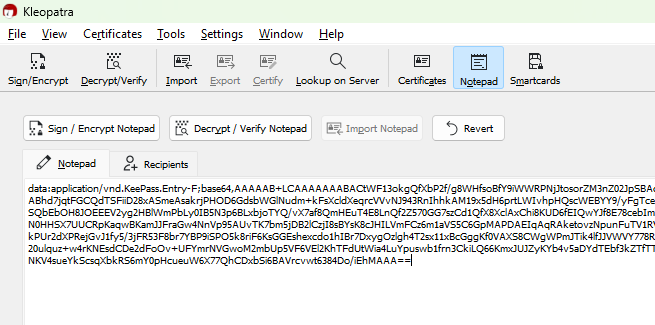

# KeePass Tips And Tricks

Beyond all of the basics of creating, saving, and managing credentials in Keepass, there are a lot of really useful features that will make using it 10x more powerful.

## Hotkeys

Keepass should be quicker to use than remembering a password and just typing it out. In order to make it quicker to use, hotkeys will be really useful.

Ctrl + Alt + K &rarr; Ctrl + F &rarr; (Ctrl + B or Ctrl + C) is a hotkey sequence I use at least 100 times a day!

Here are some global hotkeys that can be performed from anywhere in your desktop.

| Hotkey         | Action |
| -----------    | ----------- |
| Ctrl + Alt + K | Global: Open Keepass from anywhere |
| Ctrl + Alt + A | Global: Perform an autotype match from anywhere  |

Here are some of the most useful hotkeys that can be performed from within the Keepass window.

| Hotkey      | Action |
| ----------- | ----------- |
| Ctrl + F    | Find an entry. |
| Ctrl + C    | Copy and entry's password. |
| Ctrl + B    | Copy and entry's username. |
| Ctrl + V    | Perform the default autotype for a given entry.  |

## Security and configuration recommendations

### UI Configuration

TODO

### Database Configuration

TODO

### What not to do
- Store MFA secrets in KeePass


## Data Exchange
Sometimes credentials will need to be shared between different people. To do this use the group data exchange and entry data exchange.

### Sending

1. Use 'Copy Entry (Unencrypted)' to put all of the entry information into your clipboard.


2. Using Kleopatra you can PGP the contents of your clipboard for other users.




3. Send the output PGP message to your recipient in a Slack code block or via email.


### Receiving

1. Copy your received PGP message. You need to copy everything including the header and footer tags.
```
-----BEGIN PGP MESSAGE-----

...DATA...
-----END PGP MESSAGE-----
```

2. Put the data into Kleopatra.


3. Decrypt


### Pro tip
Do all the Kleopatra stuff from the task tray:


## Autotype
### Autotype for login

TODO

### Autotype for text entry

Sometimes when you have pieces of text that need to be entered into a VM or RDP session that for whatever reason doesn't let you use the clipboard. Autotype can be used to enter the information without you needing to copy it out manually.

For example, this entry to type the command to find services and their binary permissions on a Windows host:


This would be a fair amount of text to be entering manually.


By setting the autotype sequence to `{DELAY 2000}{Notes}` we can delay the input to the next window and then type out the whole of the notes field.

The delay is important as it lets you properly select the right window and field before Keepass starts typing.

## Plugins
Any plugin you install is third-party code that is getting access to your decrypted Keepass database.

===BEWARE OF INSTALLING ANY PLUGIN.==

See Modux policy docs for which plugins are authorised.

### Keeagent

TODO