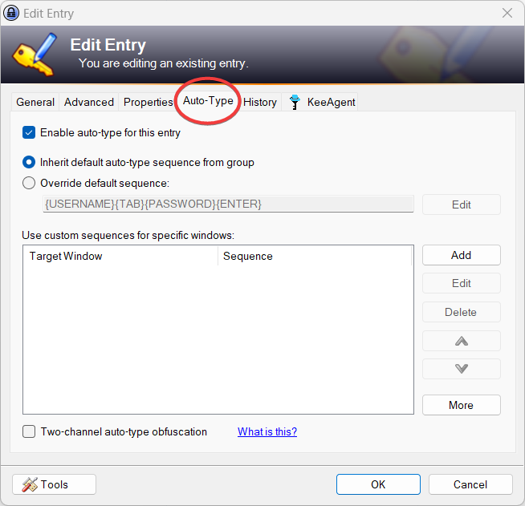

# KeePass Tips And Tricks

Beyond all of the basics of creating, saving, and managing credentials in Keepass, there are a lot of really useful features that will make using it 10x more powerful.

## Contents

1. [Hotkeys](#hotkeys)

1. [Security and configuration recommendations](#security-and-configuration-recommendations)

1. [Data Exchange](#data-exchange)

1. [Autotype](#autotype)

1. [Plugins](#plugins)

## Hotkeys

Keepass should be quicker to use than remembering a password and just typing it out. In order to make it quicker to use, hotkeys will be really useful.

Ctrl + Alt + K &rarr; Ctrl + F &rarr; (Ctrl + B or Ctrl + C) is a hotkey sequence I use at least 100 times a day!

Here are some global hotkeys that can be performed from anywhere in your desktop.

| Hotkey         | Action |
| -----------    | ----------- |
| Ctrl + Alt + K | Global: Open Keepass from anywhere |
| Ctrl + Alt + A | Global: Perform an autotype match from anywhere  |

Here are some of the most useful hotkeys that can be performed from within the Keepass window.

| Hotkey      | Action |
| ----------- | ----------- |
| Ctrl + F    | Find an entry. |
| Ctrl + C    | Copy and entry's password. |
| Ctrl + B    | Copy and entry's username. |
| Ctrl + V    | Perform the default autotype for a given entry.  |

## Security and configuration recommendations

### UI Configuration

After navigating to 'Tools &rarr; Options...'. The following settings are recommended. Everything else can be the default.

| Setting     | Recommended value |
| ----------- | -----------       |
| Security &rarr; General &rarr; Lock workspace when locking the computer or switching the user | Enabled |
| Security &rarr; General &rarr; Lock workspace when the computer is about to be suspended | Enabled |
| Security &rarr; General &rarr; Lock workspace when the remote control mode changes | Enabled |
| Security &rarr; Advanced &rarr; Enter master key on secure desktop | Enabled |
| Interface (1) &rarr; Main Window &rarr; Close button [X] minimizes main window instead of terminating the application | Enabled |
| Interface (1) &rarr; Main Window &rarr; Show additional auto-type menu commands | Enabled |
| Advanced &rarr; Start and Exit &rarr; Automatically save when closing/locking the database | Enabled |
| Advanced &rarr; Start and Exit &rarr; Automatically save after modifying an entry using the entry dialog | Enabled |
| KeeAgent &rarr; Unlock all databases when a client sends a request | Enabled |
| KeeAgent &rarr; Enable agent for Windows OpenSSH | Enabled |


### Database Configuration

After navigating to 'File &rarr; Database Settings...'. The following settings are recommended. Everything else can be the default.

| Setting     | Recommended value |
| ----------- | -----------       |
| Security &rarr; Key derivation function: | Argon2id |
| Security &rarr; Iterations | Press the "1 Second Delay" button and the bottom to automatically set iterations to a 1 second delay. When testing, aim for the number iterations to put the key transformation time to between 0.5 - 1 second.  |


### What not to do
- Store MFA secrets in KeePass


## Data Exchange
Sometimes credentials will need to be shared between different people. To do this use the group data exchange and entry data exchange.

### Sending

1. Use 'Copy Entry (Unencrypted)' to put all of the entry information into your clipboard.


2. Using Kleopatra you can PGP the contents of your clipboard for other users.


3. Send the output PGP message to your recipient in a Slack code block or via email.


### Receiving

1. Copy your received PGP message. You need to copy everything including the header and footer tags.
```
-----BEGIN PGP MESSAGE-----

...DATA...
-----END PGP MESSAGE-----
```

2. Put the data into Kleopatra.


3. Decrypt


### Pro tip
Do all the Kleopatra stuff from the task tray:


## Autotype
### Autotype for login

Autotype is a way of using KeePass to automate the action of logging into applications and services.

By default all KeePass entries will be configured with the sequence:

```
{USERNAME}{TAB}{PASSWORD}{ENTER}
```

This will work for the majority of web login forms. It will enter the username for the entry, press the TAB key, enter the password for the entry, and then press the ENTER key.

Autotype can be triggered either directly from the KeePass application or globally from any application using the following hotkeys:

Global hotkey that can be performed from anywhere in your desktop.

| Hotkey         | Action |
| -----------    | ----------- |
| Ctrl + Alt + A | Global: Perform an autotype match from the window title from anywhere  |

From within the Keepass window:

| Hotkey      | Action |
| ----------- | ----------- |
| Ctrl + V    | Perform the default autotype for a given entry.  |


The default sequence can be changed on a per-entry or group basis:



By using the 'edit' functionality you can create complex sequences for automating logging into almost any application or service.

### Autotype for text entry

Sometimes when you have pieces of text that need to be entered into a VM or RDP session that for whatever reason doesn't let you use the clipboard. Autotype can be used to enter the information without you needing to copy it out manually.

For example, this entry to type the command to find services and their binary permissions on a Windows host:


This would be a fair amount of text to be entering manually.


By setting the autotype sequence to `{DELAY 2000}{Notes}` we can delay the input to the next window and then type out the whole of the notes field.

The delay is important as it lets you properly select the right window and field before Keepass starts typing.

## Plugins
==BEWARE OF INSTALLING ANY PLUGIN.==

Any plugin you install is third-party code that is getting access to your decrypted KeePass database.

==BEWARE OF INSTALLING ANY PLUGIN.==

See Modux policy docs for which plugins are authorised internally.

### KeeAgent

KeeAgent is a really useful plugin for people that are using SSH regularly. It enables you to keep your SSH key in an encrypted form whenever your KeePass database is locked (which should be whenever you are away from your computer).

It also lets you put a password on your SSH private key in a way that is fairly invisible to you.

Recommended entry settings for your SSH key entry

| Setting     | Recommended value |
| ----------- | -----------       |
| KeeAgent &rarr; Add key to agent when database is opened/unlocked | Enabled |
| KeeAgent &rarr; Remove key from agent when database is closed/locked | Enabled |
